# 🚀 Automated CI/CD Pipeline for Node.js Todo Application

---

## 📌 Project Overview

This project demonstrates a complete **End-to-End CI/CD Pipeline** for a Node.js Todo Application using GitHub, Jenkins, Docker, Docker Hub, and AWS EC2.

Whenever code is pushed to GitHub, Jenkins automatically triggers the pipeline via Webhook, builds a Docker image, pushes it to Docker Hub, and deploys the latest version on an AWS EC2 instance.

The complete deployment process is fully automated without any manual intervention.

---

<p align="center">


</p>

---

# 🛠 Tech Stack

| Category | Technology |
|-----------|------------|
| Cloud | AWS EC2 |
| CI/CD | Jenkins |
| Source Control | GitHub |
| Containerization | Docker |
| Registry | Docker Hub |
| Operating System | Ubuntu Linux |
| Application | Node.js |

---

# 📂 Project Structure

```text
automated-cicd-pipeline/

├── app/
├── architecture/
│   ├── architecture.png
│
├── docs/
│   ├── 01-project-overview.md
│   ├── 02-aws-setup.md
│   ├── 03-jenkins-installation.md
│   ├── 04-github-webhook.md
│   └── 05-cicd-pipeline.md
│
├── screenshots/
├── Jenkinsfile
├── README.md
├── LICENSE
└── .gitignore
```

---

# ⚙️ CI/CD Pipeline

```
Developer
      │
      ▼
 GitHub Repository
      │
 GitHub Webhook
      │
      ▼
 Jenkins Pipeline
      │
 ┌──────────────────────────────┐
 │ Clone Repository             │
 │ Build Docker Image           │
 │ Login Docker Hub             │
 │ Push Docker Image            │
 │ Deploy on AWS EC2            │
 └──────────────────────────────┘
      │
      ▼
Docker Container Running
      │
      ▼
Live Node.js Application
```

---

# 📸 Project Screenshots

<table>

<tr>

<td align="center">

<b>AWS EC2 Instance</b><br><br>

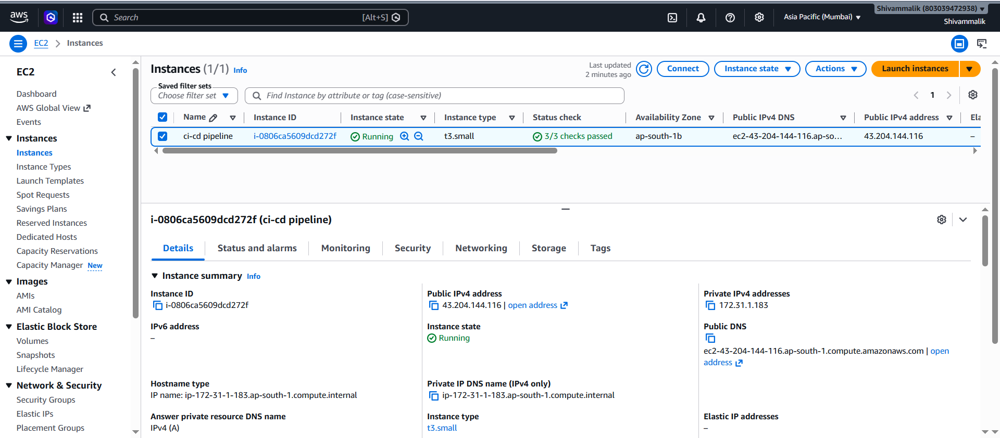

</td>

<td align="center">

<b>Security Group Configuration</b><br><br>

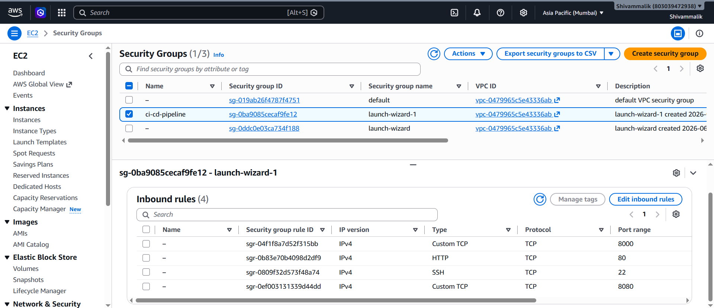

</td>

</tr>

<tr>

<td align="center">

<b>Docker Installation</b><br><br>

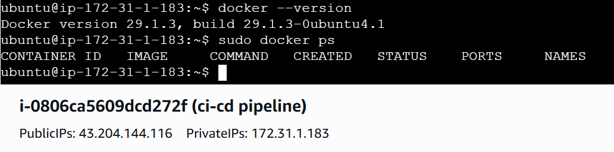

</td>

<td align="center">

<b>Jenkins Service Running</b><br><br>

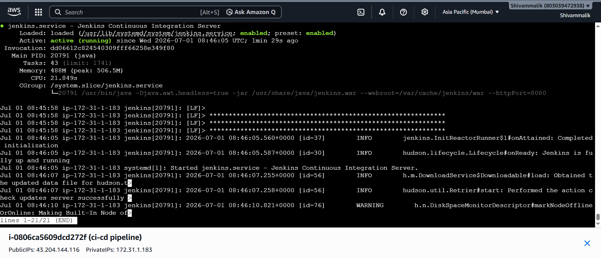

</td>

</tr>

<tr>

<td align="center">

<b>Docker Group Configuration</b><br><br>

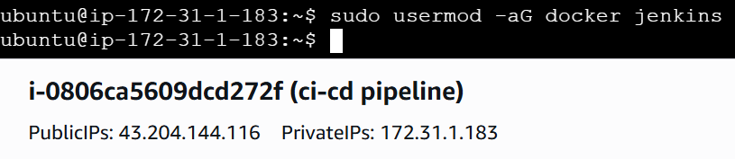

</td>

<td align="center">

<b>Jenkins Dashboard</b><br><br>

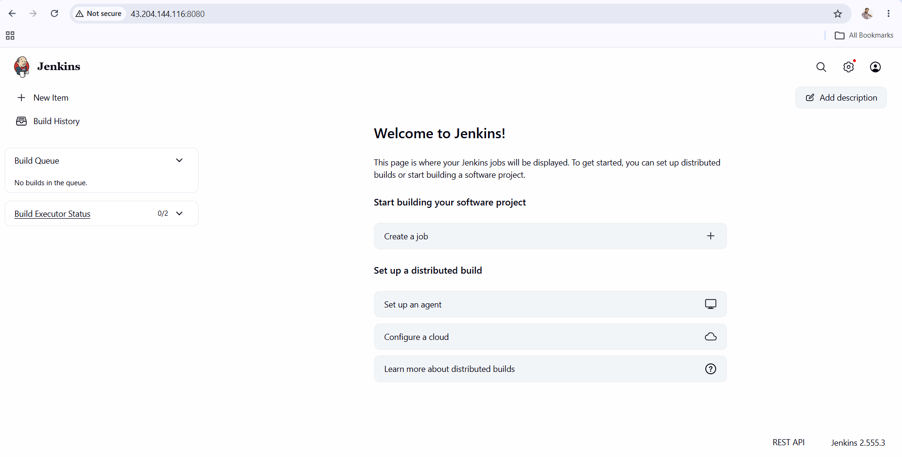

</td>

</tr>

<tr>

<td align="center">

<b>GitHub Webhook</b><br><br>

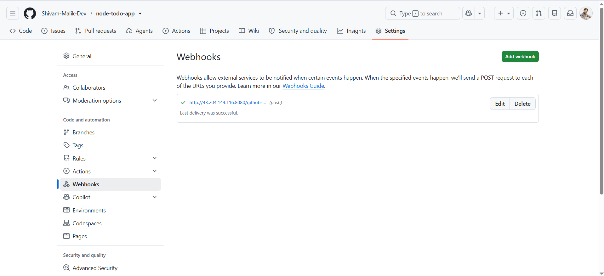

</td>

<td align="center">

<b>Pipeline Job</b><br><br>

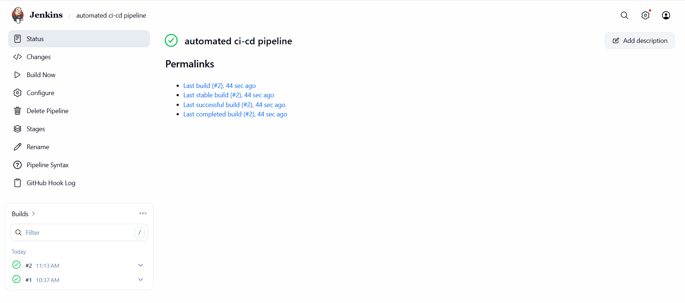

</td>

</tr>

<tr>

<td align="center">

<b>Blue Ocean Pipeline</b><br><br>

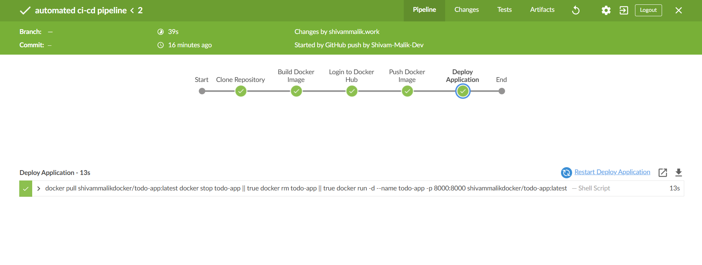

</td>

<td align="center">

<b>Docker Hub Repository</b><br><br>

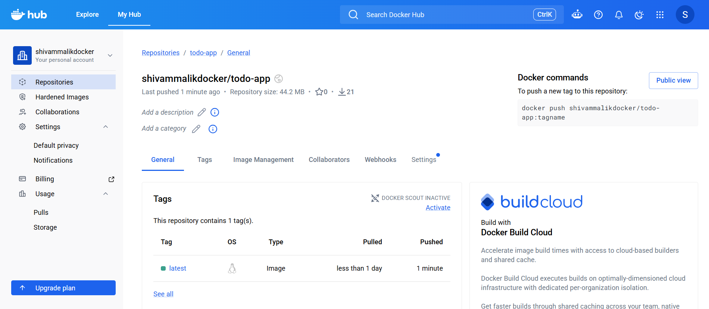

</td>

</tr>

<tr>

<td align="center">

<b>Running Docker Container</b><br><br>

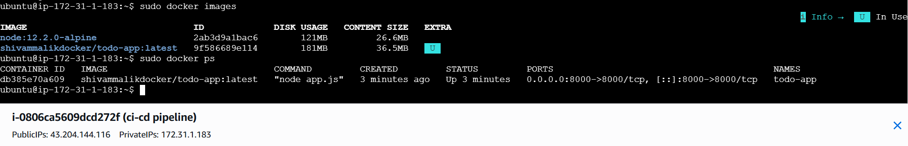

</td>

<td align="center">

<b>Live Application</b><br><br>

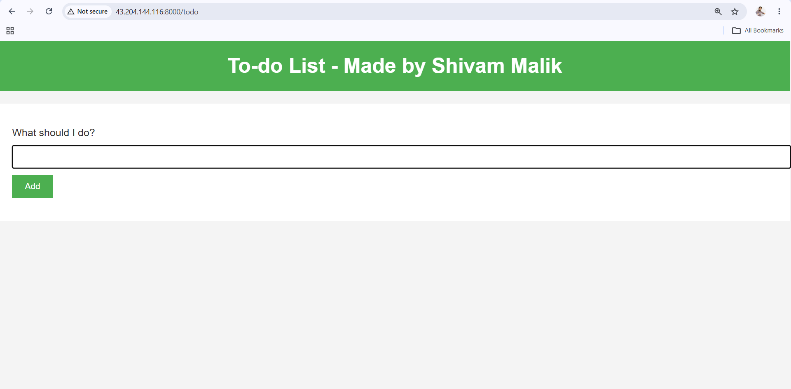

</td>

</tr>

<tr>

<td colspan="2" align="center">

<b>Automatic Deployment after GitHub Push</b><br><br>

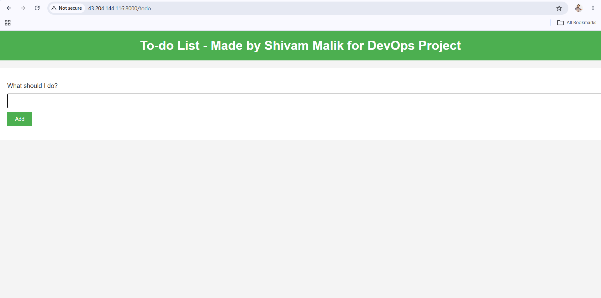

</td>

</tr>

</table>

---

# 🚀 Future Improvements

- SonarQube Integration
- Trivy Image Scanning
- Kubernetes Deployment
- ArgoCD GitOps
- Prometheus & Grafana Monitoring

---

# 👨‍💻 Author

**Shivam Malik**

🔗 GitHub  
https://github.com/Shivam-Malik-Dev

🔗 LinkedIn  
https://www.linkedin.com/in/shivam-malik-59b13a29b/

---

⭐ **If you found this project useful, consider giving it a Star.**
