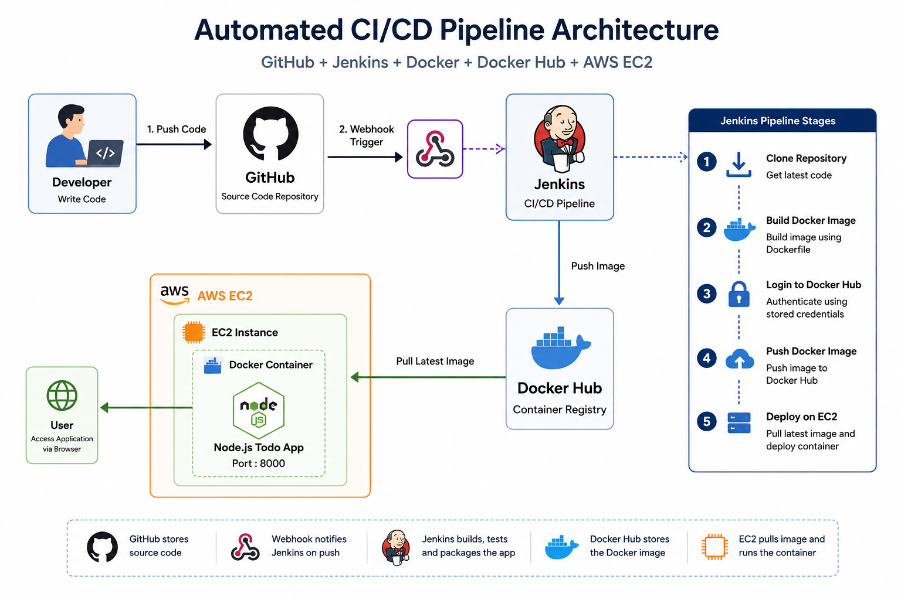

# 🚀 Automated CI/CD Pipeline for Node.js Todo Application

<p align="center">


</p>

<p align="center">


</p>

---

# 📌 Project Overview

This project demonstrates a complete **End-to-End Automated CI/CD Pipeline** for a **Node.js Todo Application** using modern DevOps tools and cloud infrastructure.

Whenever a developer pushes code to GitHub, Jenkins automatically triggers the pipeline through GitHub Webhooks, builds a Docker image, pushes it to Docker Hub, and deploys the latest application version on an AWS EC2 instance without any manual intervention.

This project follows a production-style Continuous Integration and Continuous Deployment (CI/CD) workflow.

---

# 🎯 Project Objectives

- Automate application deployment
- Eliminate manual deployment process
- Build Docker images automatically
- Push images to Docker Hub
- Deploy latest application on AWS EC2
- Demonstrate an end-to-end DevOps workflow
- Learn production-style CI/CD implementation

---

# 🏗️ Architecture Diagram

<p align="center">



</p>

---

# ⚙️ Tech Stack

| Category | Technology |
|-----------|------------|
| Version Control | Git & GitHub |
| CI/CD | Jenkins |
| Containerization | Docker |
| Container Registry | Docker Hub |
| Cloud Platform | AWS EC2 |
| Operating System | Ubuntu Linux |
| Application | Node.js |
| Automation | GitHub Webhooks |

---

# ⭐ Key Features

- Automated CI/CD Pipeline
- GitHub Webhook Integration
- Jenkins Declarative Pipeline
- Dockerized Application
- Docker Hub Image Registry
- AWS EC2 Deployment
- Automatic Container Replacement
- Zero Manual Deployment
- Production-style Workflow
- End-to-End Automation

---

# 📊 Project Metrics

| Metric | Value |
|---------|-------|
| CI/CD Tool | Jenkins |
| Cloud Platform | AWS EC2 |
| Container Platform | Docker |
| Container Registry | Docker Hub |
| Application | Node.js Todo App |
| Pipeline Stages | 5 |
| Trigger Method | GitHub Webhook |
| Build Time | ~40 Seconds |
| Deployment Time | ~15 Seconds |
| Deployment Type | Fully Automated |
| Infrastructure | Ubuntu EC2 |
| Availability | 24×7 |

---

# 📂 Project Structure

```text
automated-cicd-pipeline/

│
├── app/
│   ├── app.js
│   ├── Dockerfile
│   ├── package.json
│   └── ...
│
├── architecture/
│   └── architecture.png
│
├── docs/
│   ├── 01-project-overview.md
│   ├── 02-aws-setup.md
│   ├── 03-jenkins-installation.md
│   ├── 04-github-webhook.md
│   ├── 05-cicd-pipeline.md
│   ├── 06-deployment.md
│   └── 07-troubleshooting.md
│
├── screenshots/
│
├── Jenkinsfile
│
├── .gitignore
│
├── LICENSE
│
└── README.md
```

---

# 🔄 CI/CD Pipeline Workflow

```text
Developer

        │
        ▼

Push Code to GitHub

        │
        ▼

GitHub Webhook Trigger

        │
        ▼

Jenkins Pipeline Starts

        │
        ▼

Clone Repository

        │
        ▼

Build Docker Image

        │
        ▼

Login to Docker Hub

        │
        ▼

Push Docker Image

        │
        ▼

SSH into AWS EC2

        │
        ▼

Pull Latest Docker Image

        │
        ▼

Stop Existing Container

        │
        ▼

Run New Docker Container

        │
        ▼

Application Live
```

---

# ⚡ Jenkins Pipeline Stages

| Stage | Description |
|---------|-------------|
| Clone Repository | Fetch latest source code from GitHub |
| Build Docker Image | Build Docker image using Dockerfile |
| Login Docker Hub | Authenticate Docker Hub |
| Push Docker Image | Upload latest Docker image |
| Deploy on AWS EC2 | Pull latest image and restart container |

---

# 🚀 Deployment Workflow

1. Developer pushes code to GitHub.

2. GitHub Webhook automatically triggers Jenkins.

3. Jenkins clones the latest repository.

4. Docker image is built.

5. Jenkins logs into Docker Hub.

6. Docker image is pushed to Docker Hub.

7. AWS EC2 pulls the latest image.

8. Existing container is stopped.

9. Old container is removed.

10. New container starts automatically.

11. Updated application becomes live.

---

# 📸 Project Screenshots

## AWS EC2 Instance


---

## Security Group Configuration


---

## Jenkins Dashboard


---

## Jenkins Pipeline Execution


---

## Docker Hub Repository


---

## Running Docker Container


---

## Live Application


---

# 📖 Documentation

Complete project documentation is available inside the **docs** directory.

| Document | Description |
|-----------|-------------|
| 01-project-overview | Project Introduction |
| 02-aws-setup | AWS EC2 Configuration |
| 03-jenkins-installation | Jenkins Installation Guide |
| 04-github-webhook | GitHub Webhook Setup |
| 05-cicd-pipeline | Jenkins Pipeline Configuration |
| 06-deployment | Deployment Process |
| 07-troubleshooting | Common Issues & Solutions |

---

# 🎯 Skills Demonstrated

- Continuous Integration (CI)
- Continuous Deployment (CD)
- Jenkins Pipeline
- Docker
- Docker Hub
- AWS EC2
- Git & GitHub
- GitHub Webhooks
- Linux Administration
- Shell Commands
- DevOps Automation

---

# 🚀 Future Enhancements

- Kubernetes Deployment
- Helm Charts
- Terraform Infrastructure
- SonarQube Integration
- Trivy Image Scanning
- Prometheus Monitoring
- Grafana Dashboard
- ArgoCD GitOps Deployment
- Multi-Environment Deployment
- Slack Notification Integration

---

# 👨‍💻 Author

## Shivam Malik

**Cloud & DevOps Engineer**

### Connect with me

- GitHub: https://github.com/Shivam-Malik-Dev
- LinkedIn: https://www.linkedin.com/in/shivam-malik-59b13a29b/

---

# ⭐ Support

If you found this project useful, consider giving it a ⭐ on GitHub.

It motivates me to build and share more DevOps projects.

---